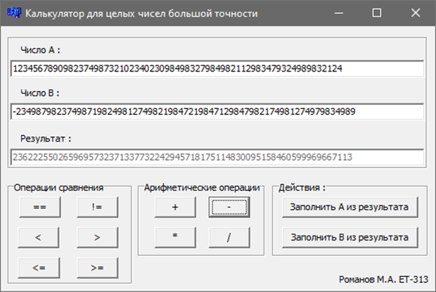

# Калькулятор для целых чисел большой точности
Данная программа разработана в процессе выполнения курсовой работы осеннего семестра 2022г.

## Постановка задачи
Необходимо разработать компьютерную программу, реализующую программу «Калькулятор для целых чисел большой точности», на языке программирования С. Среда разработки – Borland C++ 5.5.

## Примеры работы

